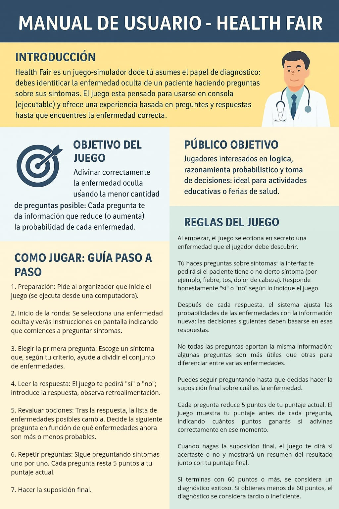

# Feria de la Salud - Simulador de diagnóstico (versión actualizada)



Diapositivas

https://docs.google.com/presentation/d/1Fxznf-KsAobdd3rDgwGNmdcKe78tzWAbCWPtiiTovH4/edit?usp=sharing

## Instrucciones rápidas:

1. Asegúrese de tener Python 3.8+ instalado.
2. Instala pygame si no está instalado:

   ```bash
   pip install pygame

Notas:

- Todos los cálculos probabilísticos se realizan en logic/probability_engine.py.
- Después de preguntar por un síntoma, se recalculan (para todas) las probabilidades usando Bayes.
